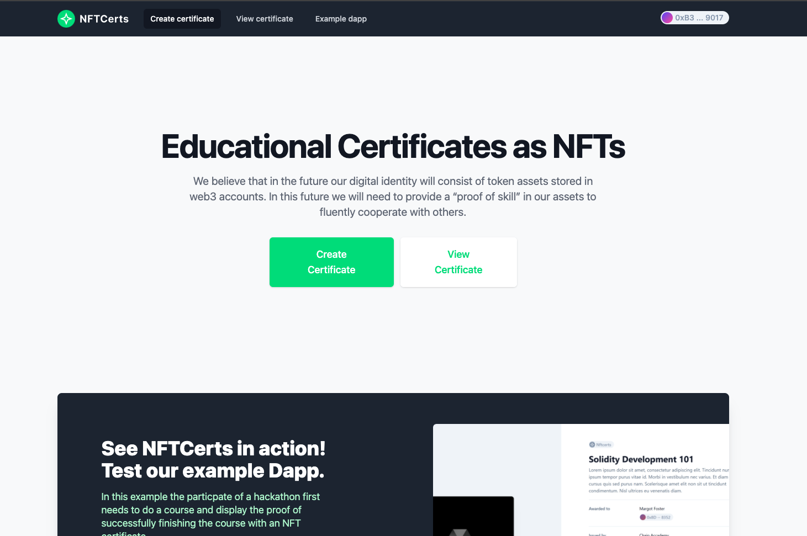
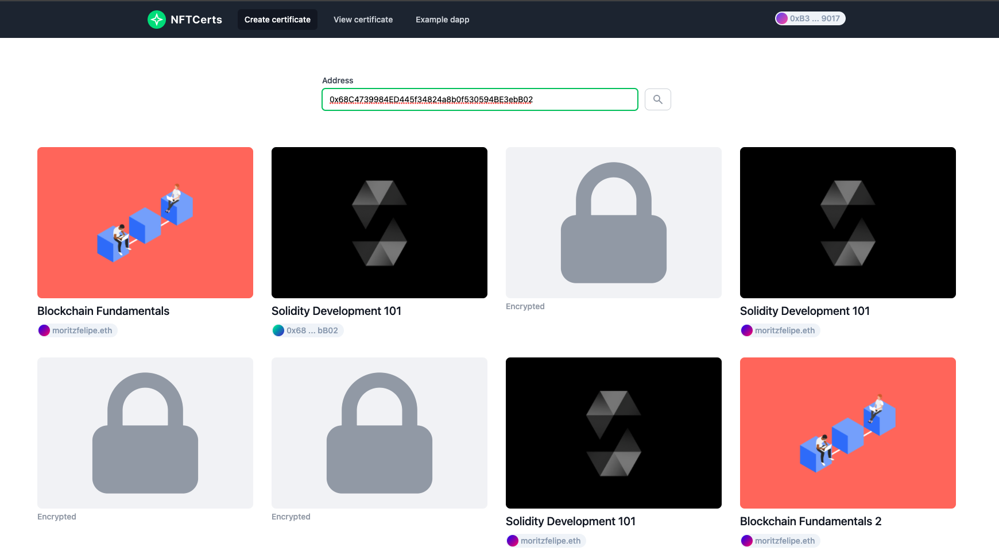

 
 Make it easy to create and verify educational certificates as NFTs.
We believe that in the future our digital identity will consist of token assets stored in web3 accounts. In this future we will need to provide a “proof of skill” in our assets to fluently cooperate with others.

<h2 id="credits"> :link: Project Links</h2>
<ul>
<li><a target="_blank" href="https://nftcerts.netlify.app/">Live Project</a> </li>
<li><a target="_blank" href="https://showcase.ethglobal.co/nfthack2022/nftcerts">NFTHack 2022 Public URL </a></li>
<li><a target="_blank" href="https://github.com/nftcertsorg/nftcerts-hardhat">Smart Contract Github Repo</a></li>
</ul>

[//]: # ()
[//]: # ()
[//]: # ()
[//]: # (<h3 align="center"> Education Certificates as NFTs</h3>)

[//]: # ()
[//]: # (
 )

[//]: # ()

[//]: # (
)

[//]: # ()
[//]: # (
)

[//]: # (We believe that in the future our digital identity will consist of token assets stored in web3 accounts. In this future we will need to provide a “proof of skill” in our assets to fluently cooperate with others.)

[//]: # (
)

<h2> :books: IMS Learning Certification Standard</h2>

Our educational certificate NFTs store their data based on one of the most recognised certification standards. The Open Badges standard by the IMS.

<h2>:man_technologist: Privacy Enabled
</h2>

We allow the recpients of the certificates to encrypt their certificate data and only show the data to whom they choose.

<h2>:lock: Secure Metadata</h2>

Our contracts store a hash of the meta data to be sure the metadata that is displayed is the same as the data stored. Our contracts store a hash of the meta data to be sure the metadata that is displayed is the same as the data stored.
 

<!-- Technologies -->
<h2 id="credits"> :technologist:  Technologies</h2>

A list of project's technologies

<ul>

<li>
Solidty
</li>

<li>
Next JS / React
</li>

<li>
Ethers Js
</li>

<li>
Moralis
</li>

<li>
IPFS (Intra-Planetary File System)
</li>

<li>
ENS system
</li>

<li>
Web3Modal
</li>

<li>
Openzeppellin
</li>
</ul>

<h2 id="credits"> :chains: Network Deployed</h2>

The project was deployed on Polygon via the Mumbai Testnet

